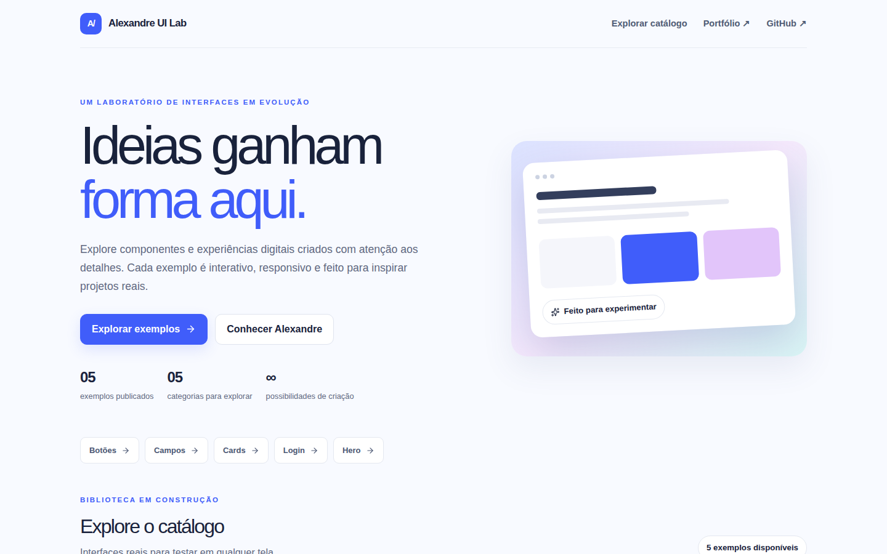
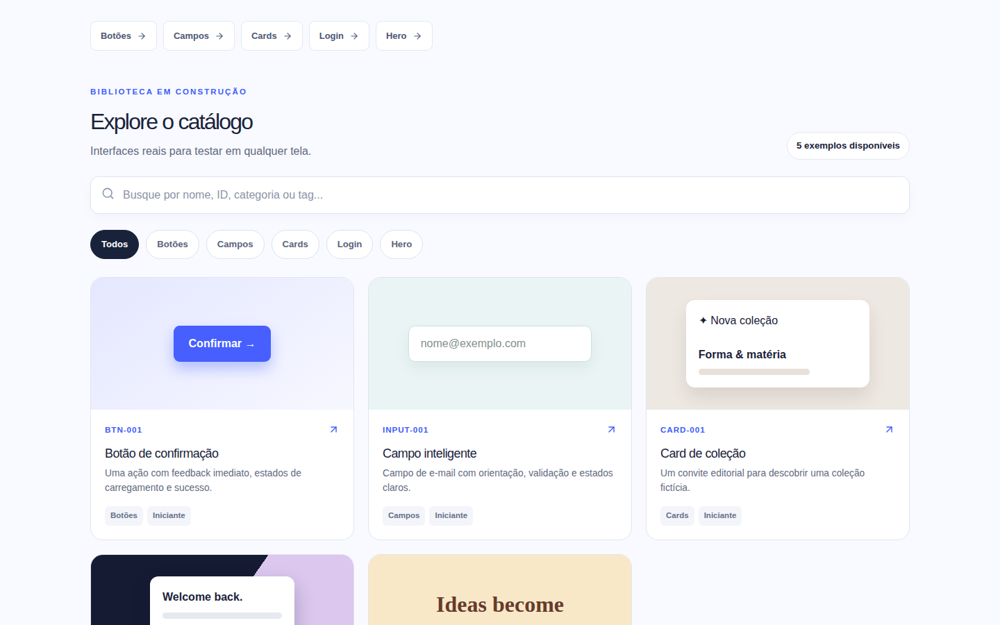
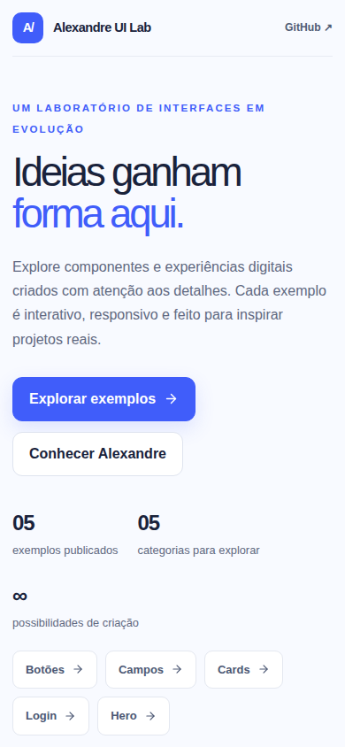

<p align="center">
  
</p>

<h1 align="center">Alexandre UI Lab</h1>

<p align="center">
  <strong>Ideias ganham forma aqui.</strong><br>
  Um catálogo de interfaces para explorar, testar e adaptar a projetos reais.
</p>

<p align="center">
  <a href="https://ui.alexandresilva.dev/"><strong>Explorar o laboratório ↗</strong></a>
  &nbsp;·&nbsp;
  <a href="https://ui.alexandresilva.dev/#catalogo">Ver os exemplos</a>
  &nbsp;·&nbsp;
  <a href="https://alexandresilva.dev/">Conhecer Alexandre</a>
</p>

<p align="center">
  <a href="https://github.com/Alexandre458/alexandre-ui-lab/actions/workflows/ci.yml"></a>
  <a href="https://github.com/Alexandre458/alexandre-ui-lab/actions/workflows/deploy-production.yml"></a>
</p>

[](https://ui.alexandresilva.dev/)

## Uma biblioteca para experimentar

Cada exemplo tem uma página própria, uma prévia interativa e acesso ao código. A busca encontra interfaces por nome, ID, categoria ou tag. Nos detalhes, é possível alternar entre **desktop, tablet e celular** ou abrir a prévia em tela cheia.

| Catálogo e busca | Visualização no celular |
| :--- | :--- |
|  |  |

## Exemplos em destaque

| ID | Interface | O que você pode testar |
| :--- | :--- | :--- |
| [BTN-001](https://ui.alexandresilva.dev/buttons/confirmation-button/) | Botão de confirmação | Estados de carregamento e sucesso. |
| [INPUT-001](https://ui.alexandresilva.dev/inputs/smart-email-field/) | Campo inteligente | Orientação e validação local de e-mail. |
| [CARD-001](https://ui.alexandresilva.dev/cards/editorial-collection-card/) | Card de coleção | Composição editorial e ação interativa. |
| [LOGIN-001](https://ui.alexandresilva.dev/login/workspace-login/) | Login Workspace | Formulário demonstrativo com feedback local. |
| [HERO-001](https://ui.alexandresilva.dev/hero/atelier-hero/) | Hero Atelier | Abertura editorial com layout adaptativo. |

As demonstrações usam dados fictícios. O formulário de login não autentica nem envia credenciais.

## Como funciona

O projeto usa **Next.js 16**, **React 19**, **TypeScript 5** e **Tailwind CSS 4**. O Registry em `src/registry/entries.ts` guarda os metadados; cada demo fica em `src/demos/` e é carregada somente na prévia. O build gera um site estático em `out/`, servido sem processo Node permanente.

```text
src/app/              páginas, metadados e rotas
src/components/lab/   catálogo e controles de visualização
src/demos/            interfaces interativas
src/registry/         IDs, categorias e busca
tests/                testes de Registry e navegador
```

## Rodar localmente

Requisitos: **Node.js 24** e **npm 11**. No WSL com NVM, carregue o Node Linux antes de executar os comandos.

```bash
npm ci
npm run dev
```

Abra `http://localhost:3000`. Para validar uma mudança:

```bash
npm run lint
npm run typecheck
npm test
npm run test:e2e
npm run build
npm run test:static
```

O Playwright testa desktop, tablet e celular; também verifica o site estático exportado. Para entender a estrutura e a publicação, consulte [Arquitetura](docs/ARCHITECTURE.md) e [Deploy](docs/DEPLOYMENT.md).

---

Criado por [Alexandre Oliveira da Silva](https://alexandresilva.dev/). [Acesse o laboratório](https://ui.alexandresilva.dev/) para testar as interfaces no navegador.
