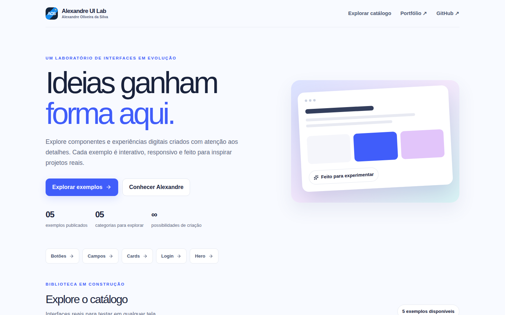
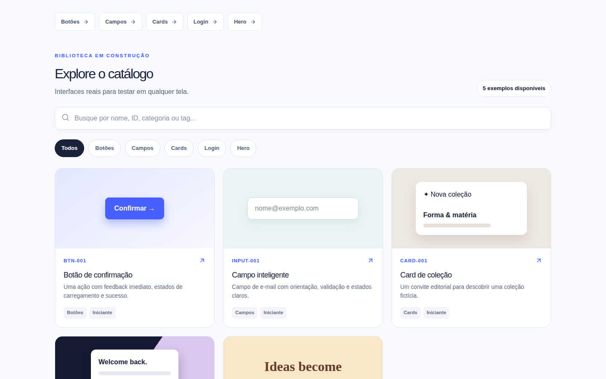
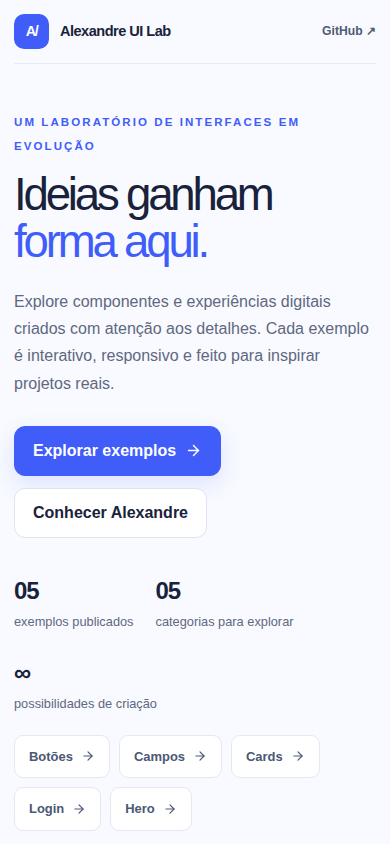

<p align="center">
  
</p>

<h1 align="center">Alexandre UI Lab</h1>

<p align="center">Uma criação de <strong>Alexandre Oliveira da Silva</strong>, com a marca AOS compartilhada pelos projetos do portfólio.</p>

<p align="center">
  <strong>Ideias ganham forma aqui.</strong><br>
  Um catálogo de interfaces para explorar, testar e adaptar a projetos reais.
</p>

<p align="center">
  <a href="https://ui.alexandresilva.dev/"><strong>Explorar o laboratório ↗</strong></a>
  &nbsp;·&nbsp;
  <a href="https://ui.alexandresilva.dev/#catalogo">Ver os exemplos</a>
  &nbsp;·&nbsp;
  <a href="https://alexandresilva.dev/">Conhecer Alexandre</a>
</p>

<p align="center">
  <a href="https://github.com/Alexandre458/alexandre-ui-lab/actions/workflows/ci.yml"></a>
  <a href="https://github.com/Alexandre458/alexandre-ui-lab/actions/workflows/deploy-production.yml"></a>
</p>

[](https://ui.alexandresilva.dev/)

## Uma biblioteca para experimentar

Cada exemplo tem uma página própria, uma prévia interativa e acesso ao código. A busca encontra interfaces por nome, ID, categoria ou tag. Nos detalhes, é possível alternar entre **desktop, tablet e celular** ou abrir a prévia em tela cheia.

| Catálogo e busca | Visualização no celular |
| :--- | :--- |
|  |  |

## Exemplos em destaque

| ID | Interface | O que você pode testar |
| :--- | :--- | :--- |
| [BTN-001](https://ui.alexandresilva.dev/buttons/confirmation-button/) | Confirmação reversível de uma ação | Confirmar uma vez por ciclo, bloquear repetição durante a espera e desfazer explicitamente. |
| [INPUT-001](https://ui.alexandresilva.dev/inputs/smart-email-field/) | Diagnóstico e correção explícita de e-mail | Detectar domínio digitado incorretamente e aplicar sugestão somente por escolha da pessoa. |
| [CARD-001](https://ui.alexandresilva.dev/cards/editorial-collection-card/) | Coleção editorial com salvar e inspecionar | Manter um único favorito por objeto e revelar o conteúdo da coleção sem perder o estado salvo. |
| [LOGIN-001](https://ui.alexandresilva.dev/login/workspace-login/) | Acesso demonstrativo a um workspace | Validar entradas fictícias, alternar visibilidade da senha e limpar credenciais após acesso local. |
| [HERO-001](https://ui.alexandresilva.dev/hero/atelier-hero/) | Abertura editorial com navegação de seções | Navegar entre destinos reais da página e fechar o menu móvel por escolha ou Escape. |
| [FUND-0006](https://ui.alexandresilva.dev/fundamentals/contextual-action-button/) | Caderno de prática com pré-requisitos | Concluir etapas manuais em ordem e reabrir uma etapa invalidando suas dependentes. |
| [FUND-0007](https://ui.alexandresilva.dev/fundamentals/contextual-action-store/) | Reserva local de peças com estoque | Reservar unidades de um estoque finito e devolver a última unidade sem afetar outros produtos. |
| [FUND-0008](https://ui.alexandresilva.dev/fundamentals/contextual-action-environmental/) | Comparador de emissões por base equivalente | Comparar emissões totais e intensidade por unidade sem confundir aumento de produção com piora de eficiência. |
| [FUND-0009](https://ui.alexandresilva.dev/fundamentals/contextual-action-cultural-producer/) | Mapa de lugares para uma sessão cultural | Selecionar até três assentos livres e confirmar uma reserva revisável do conjunto escolhido. |
| [FUND-0010](https://ui.alexandresilva.dev/fundamentals/contextual-action-software-team/) | Quadro de release com dependências | Simular publicação somente após verificações e reverter a release para a versão anterior. |
| [FUND-0011](https://ui.alexandresilva.dev/fundamentals/assisted-field-preventive-clinic/) | Agenda preventiva com horários disponíveis | Excluir horários ocupados e preservar apenas seleção elegível ao mudar o dia. |
| [FUND-0012](https://ui.alexandresilva.dev/fundamentals/assisted-field-architecture-studio/) | Programa de ambientes com limite de área | Alocar área entre ambientes e bloquear um programa cuja soma ultrapasse a área disponível. |
| [FUND-0013](https://ui.alexandresilva.dev/fundamentals/assisted-field-financial-platform/) | Livro-caixa com centavos e estorno | Interpretar valores brasileiros em centavos e derivar saldo com receitas, despesas e estorno de lançamento. |
| [FUND-0014](https://ui.alexandresilva.dev/fundamentals/assisted-field-reading-community/) | Diário de leitura com spoiler controlado | Registrar avaliação e anotação local, revelando trecho com spoiler somente por escolha explícita. |
| [FUND-0015](https://ui.alexandresilva.dev/fundamentals/assisted-field-mobility-brand/) | Comparador de trajetos por velocidade | Estimar minutos por distância e velocidade, comparar veículos e rejeitar origem igual ao destino. |
| [FUND-0016](https://ui.alexandresilva.dev/fundamentals/assisted-field-creative-school/) | Planejador de meta de estudos por capacidade | Limitar meta de módulos à capacidade de seis semanas e duas aulas necessárias por módulo. |
| [FUND-0017](https://ui.alexandresilva.dev/fundamentals/assisted-field-design-store/) | Pedido de coleção com decomposição de preço | Calcular subtotal por quantidade, separar adicional de entrega e congelar o pedido confirmado até revisão. |
| [FUND-0018](https://ui.alexandresilva.dev/fundamentals/campos-assistidos-plataforma-ambiental/) | Leitura ambiental com unidade e meta | Validar leitura conforme a unidade da iniciativa e calcular percentual da meta sem manter valor de outra iniciativa. |
| [FUND-0019](https://ui.alexandresilva.dev/fundamentals/assisted-field-cultural-producer/) | Bilheteria assistida com validação cruzada | Gerar bilhete nominal somente com evento, quantidade inteira elegível, nome e e-mail válidos. |
| [✅ FUND-0020](https://ui.alexandresilva.dev/fundamentals/editor-de-identificador-de-branch/) | Editor de identificador de branch com sandbox git | Normalizar prefixo e nome em tempo real, detectar nomes reservados e ramos locais em colisão, e corrigir sem impactar outro ramo. |

As demonstrações usam dados fictícios e estado local. Cada experiência apresenta uma regra própria: pré-requisitos, estoque, base de comparação, lugares disponíveis, dependências de release, capacidade de agenda, áreas, centavos, spoilers, duração de trajetos ou limites de metas. Reiniciar restaura a fixture inicial; revisar permite corrigir escolhas. Login, reservas, lançamentos, leituras, pedidos e bilhetes não enviam dados a serviços reais.

## Como funciona

O projeto usa **Next.js 16**, **React 19**, **TypeScript 5** e **Tailwind CSS 4**. O Registry em `src/registry/entries.ts` guarda os metadados; cada demo fica em `src/demos/` e é carregada somente na prévia. O build gera um site estático em `out/`, servido sem processo Node permanente.

```text
src/app/              páginas, metadados e rotas
src/components/lab/   catálogo e controles de visualização
src/demos/            interfaces interativas
src/registry/         IDs, categorias e busca
tests/                testes de Registry e navegador
```

## Rodar localmente

Requisitos: **Node.js 24** e **npm 11**. No WSL com NVM, carregue o Node Linux antes de executar os comandos.

```bash
npm ci
npm run dev
```

Abra `http://localhost:3000`. Para validar uma mudança:

```bash
npm run lint
npm run typecheck
npm test
npm run test:e2e
npm run build
npm run test:static
```

O Playwright testa desktop, tablet e celular; também verifica o site estático exportado. Para entender a estrutura e a publicação, consulte [Arquitetura](docs/ARCHITECTURE.md) e [Deploy](docs/DEPLOYMENT.md).

---

Criado por [Alexandre Oliveira da Silva](https://alexandresilva.dev/). [Acesse o laboratório](https://ui.alexandresilva.dev/) para testar as interfaces no navegador.
